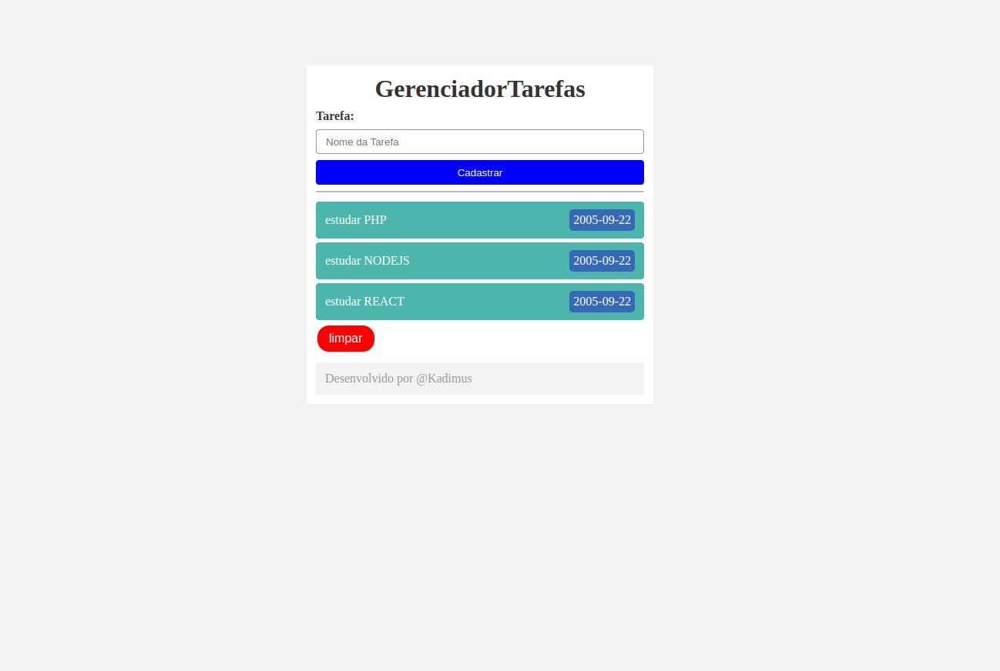

# GerenciadorTarefas

## Tecnologias
* **PHP**
* **HTML**
* **CSS**

## Desenvolver 📝

- [x] aplicar __line-through__ 💡
- [ ] aplicar icones nas tarefas 💡
- [ ] refatorar o código 💡
- [ ] enviar email da tarefa 💡

📸 SCREENSHOT

